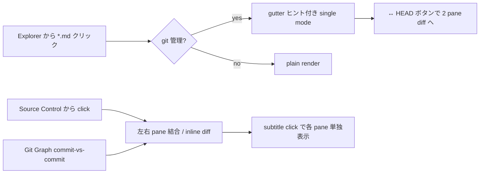
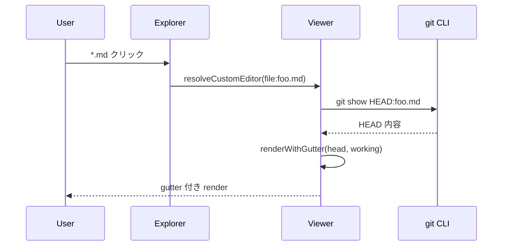

<!-- cspell:ignore auxclick -->

# rendered-markdown-diff

VS Code 拡張。`*.md` のデフォルト editor として、ファイルを **レンダリング済み markdown のまま** 表示する。git の文脈に応じて表示モードを自動で切り替え、AI 生成 md ドキュメントの大量レビュー運用を主眼に据えている。

- **単独で開かれた md** — 通常のプレビュー。`file:` で working tree が HEAD と差があれば左マージンに **エディタ gutter 風** (緑/青帯・赤三角) のヒントを出す
- **diff editor の片側として開かれた md** (Source Control / Git Graph / `vscode.diff`) — 左右 2 pane を結合してインラインハイライト diff を描画
- **ファイル更新を自動検知** — VSCode editor の save と外部ライター (Claude Code 等) の atomic write 両方に追従して再描画
- **mermaid フェンスを SVG レンダリング** — クリックで拡大 dialog (auto-scale / ズーム / drag pan)

ビルド・publish・VS Code API 利用上の落とし穴など、本 monorepo 共通の話は親ディレクトリの [`../README.md`](../README.md) を参照のこと。本書はこの拡張固有の挙動だけを扱う。

## 自前実装の目的

AI コーディング導入で大量生成される md ドキュメントを git diff レビューする運用にあたり、既存の第三者拡張 (例: `xpenghans2.md-diff-preview`) は `window.activeTextEditor` 前提で `workbench.editorAssociations` で `*.md` を preview 強制している構成では「No active editor found」で動かなかった。CustomReadonlyEditor で `*.md` のデフォルト editor を取り、Tab API + pair coordination で URI を解決して preview / text / diff いずれのタブ種別からも動くよう自前で書き直したのが本拡張。

OSS 競合サーベイ結果として、「**`customEditors.priority="default"` で `*.md` を default editor として取り、git working tree / Git Graph 経由の commit-vs-commit 両方を rendered markdown のまま inline diff する**」というニッチを OSS で押さえている既存実装は事実上存在しないため、車輪の再発明にはなっていない。

## 依存 / 前提

- **`vscode.git`** (VSCode 同梱の Git 拡張) — `package.json` の `extensionDependencies` に指定。`toGitUri` 等で必須なのでハード依存
- **`mhutchie.git-graph`** (第三者拡張、VS Code 標準ではない) — Git Graph の commit-vs-commit 経路で使う `git-graph:` URI scheme の提供元。**ハード依存にはしていない** (Explorer 単独表示 / Source Control diff / mermaid 等は Git Graph 無しでも動くため、`extensionDependencies` に入れると未導入ユーザーで拡張全体が activate しなくなり過剰)。Git Graph 経由の比較を本拡張で受けたい場合は、ユーザー側で `mhutchie.git-graph` を別途インストールする

## 起動方法

| 経路                                                       | 動作                                                                                                                                                       |
| ---------------------------------------------------------- | ---------------------------------------------------------------------------------------------------------------------------------------------------------- |
| Explorer / ファイルツリーから `*.md` クリック              | 単独モード。`file:` で working tree ≠ HEAD なら **gutter ヒント** (緑帯=追加 / 青帯=変更 / 赤三角=削除位置) を左マージンに出す。それ以外は plain render    |
| Source Control から `*.md` クリック                        | `coordinatePair` で左右 pane を結合し、HEAD 側 / 作業ツリー側それぞれをインライン diff ハイライト付きで描画                                                |
| Git Graph から commit-vs-commit クリック                   | `git-graph:` URI の base64 query を decode して両 commit の内容で diff 描画。追加/削除されたファイル diff (片側 `/file` URI) も自動で拾うよう URI 修正済み |
| エディタタブ右上の `$(go-to-file)` / `$(preview)` アイコン | viewer ↔ text editor を 1 クリックで切替え                                                                                                                |

`package.json` の `customEditors.priority="default"` で `*.md` のデフォルト editor として登録される。`workbench.editorAssociations` で `*.md` を明示的に別 viewType に上書きしない限り常にこちらが採用され、拡張を無効化すると通常の text editor / preview にフォールバックする。

## 操作リファレンス

### viewer ヘッダーのアクション

ボタンは **単独/比較で出し分けず**、pane が表示している URI の scheme + git 文脈から `computeActions(uri, diffPair)` で一律に決まる (相互切替のタブアイコンのみ別系統)。ラベルは記号 + 英単語に簡素化し、詳細は `title` 属性で補完。

| ボタン                   | 出る条件                                              | 動作                                                                                          |
| ------------------------ | ----------------------------------------------------- | --------------------------------------------------------------------------------------------- |
| `✎ Edit`                 | `file:` scheme                                        | テキストエディタで開く (編集可能)。単独なら同 tab を reopen、diff pane なら隣接 column に開く |
| `↔ HEAD`                | `file:` + git 管理下 **かつ単独モード**               | HEAD 版との diff を開く (`coordinatePair` が両側を結合して inline ハイライト)                 |
| `↔ Worktree`            | 非 `file:` (`git:` / `git-graph:`) **かつ単独モード** | decode した filePath から作業ツリー file: を導出し `vscode.diff` で 2 pane                    |
| `→ Worktree`             | 非 `file:` で対応する作業ツリーファイルが実在         | 対応する作業ツリーのファイルを viewer で開く。実在しなければ **無効化表示**                   |
| `</> Source`             | 非 `file:`                                            | この ref 内容を read-only テキスト (`rmd-source:` 仮想スキーム) で開く                        |
| `⎇ Commit`               | 常時 (git 管理下)                                     | 表示中ファイルの commit を `git-commit-browser` のコミットブラウザで開く (コマンド橋渡し)     |
| `⎇ Compare`              | 比較モードの **右(modified) pane のみ**               | この比較の 2 ref を `git-commit-browser` の ref 間比較で開く (コマンド橋渡し)                 |
| パス (subtitle) クリック | 比較モードの各 pane                                   | その pane の URI を単独 viewer で開く                                                         |

**diff モードでの抑制**: 既に「比較中」なので `↔ HEAD` / `↔ Worktree` は出さない。diff の片側が `file:` (= 作業ツリーが既に画面にある) なら `→ Worktree` も出さない。Git Graph の commit-vs-commit (両側 git-graph) では `→ Worktree` は有効。

### markdown 内のリンク

- **相対 / 絶対パス**:
    - 単独モード → 現行 URI と同じ文脈 (working tree / 同 ref / 同 commit) で開く。`git-graph:` 内のリンクなら同 commit の別 md へ遷移
    - 比較モード → `resolveLinkTarget` で **両側 ref それぞれ** にリンクを解決し、`vscode.diff` で **同じコミットペアを維持した比較** を開く (片側しか解決できなければ単独フォールバック)
- ディレクトリへのリンク → GitHub 同様その配下 `README.md` に振り替えて開く
- **コミット参照** (本文中の検証済み bare SHA、GitHub/GitLab の commit・blob URL) → `git-commit-browser` のコマンドへ橋渡し (拡張が無ければ commit URL は外部ブラウザにフォールバック)
- `http(s):` / `mailto:` / `vscode(-insiders):` / `ftp:` → `vscode.env.openExternal` で OS の既定ハンドラに渡す
- `#fragment` のみ → ブラウザ標準のページ内移動 (heading anchor は未実装のため現状は no-op)

### クリック挙動 (タブ内切替 / 新タブ)

リンク・各種ボタンの遷移は **通常クリックでタブ内切替、Ctrl/⌘ or 中クリックで新タブ**:

- 通常クリック → アクティブ column の **preview タブ** を再利用 (`vscode.open(..., {preview:true})`)。連続遷移でも同じタブが置き換わるのでタブ増殖しない
- Ctrl / ⌘ / 中クリック → preview にせず別タブ (`preview:false`)
- webview の `click` / `auxclick` で修飾子を検出し `newTab` フラグを host に送出

### ナビゲーション履歴 (戻る / 進む)

ハイブリッド方式 (案 B): 遷移は実エディタを開いたまま (URI バインドが正しいので Copy Path / Reveal / reopen-as-text / git decoration / Reload 復元など VSCode 機能との整合性を壊さない) で、拡張側に訪問順スタック (`navHistory`) だけ持つ。

- **マウスの戻る/進む (button 3 / 4)** と **Alt+← / Alt+→** を webview で捕捉
- 自前履歴に対象があれば過去 URI を `vscode.open(..., {preview:true})` で実遷移、無ければ VSCode 標準 `navigateBack` / `navigateForward` にフォールバック
- リンク click / `openInViewer` は次の resolve を push 扱いに、外部 (Explorer/QuickOpen) からの open は履歴セッションをリセット、diff resolve は履歴に積まない
- 既知の割り切り: 単一スタックなので複数エディタ列で別系統を同時に辿るケースは正確に追えない (主用途の 1 列リンク追跡では十分)
- mermaid 拡大 overlay 表示中は誤爆防止で履歴操作を無視

### その他ショートカット

- **Ctrl+F / Cmd+F** — webview 組み込みの Find widget (レンダリング後テキストを検索。mermaid SVG 内テキストは対象外)
- **タブ右上アイコン** — viewer ⇔ text editor のトグル (`$(preview)` / `$(go-to-file)`)。dirty でなければアクティブ text editor を閉じてから同 column に viewer を開くので新規タブ増殖なし
- **mermaid SVG クリック** — 拡大 dialog を開く (詳細は後述)

## ファイル変更時の自動再描画

`vscode.workspace.createFileSystemWatcher` で表示中の `file:` URI を監視し、変更を検知したら自動で webview を再レンダリングする。

- 単独モード: 自身の URI を watch
- 比較モード: `diffPair` の両側のうち `file:` scheme のものを watch (working tree 側)
- VSCode editor save (in-place 書き込み) と、Claude Code 等の外部ライターによる **atomic rename** (temp file → rename) の両方に対応するため、`onDidChange` / `onDidCreate` / `onDidDelete` 全部 listen して 100ms debounce で coalesce
- 再レンダリング時に action handler を一度 dispose して再登録するので listener 累積なし。scroll sync 登録は初回のみ
- 検知の都合上、再描画のたびに **スクロール位置はリセット** される (preserve は今後の課題)

## Mermaid サポート

` ```mermaid` フェンスは webview 側で SVG レンダリングされる。esbuild が `media/webview.js` に bundle した mermaid 本体を webview に読み込ませ、`.mermaid` クラスの要素を `mermaid.run()` で SVG に置換する。

- theme は webview の dark / light に追随 (`body` の class から検出)
- レンダリング完了タイミングで `mdd-rail-update` event を発火して、右側 rail のマーカー位置を再計算
- `cspSource` + `'unsafe-eval'` を CSP に許可 (mermaid 内部の `Function` 構文対応)。font-src は `data:` 許可で SVG 内インライン font 対応

レンダリング動作確認用サンプル:





### Mermaid 拡大ダイアログ

レンダリング済みの mermaid SVG を **click** するとモーダル overlay の拡大ダイアログが開く。

- **テキスト基準の auto-scale** — dialog 内の最小文字高を実測し、`TARGET_TEXT_PX = 16` 未満なら必要な倍率で wrapper 幅を自動拡大 (小さい画面でも常に「文字が読めるサイズ」を保証)
- **ヘッダー操作** — `−` / 倍率ラベル (`100%` 等) / `+` / `Fit` (auto-scale に戻す) / `×`
- **Ctrl + Wheel** で 1.25 倍刻みの連続ズーム (範囲: `0.25` 〜 `8.0`)
- **左ドラッグで pan** — `overlay-content` の `scrollLeft` / `scrollTop` を delta 反転加算 (`cursor: grab` / `grabbing`)
- **左ドラッグ + Ctrl / Cmd** — pan を抑止して native text 選択モードに切替え (`.mdd-mermaid-select-mode` クラスで `cursor: text` / `user-select: text`)
- **中 / 右クリック** — 介入せず browser 標準動作 (autoscroll / contextmenu) のまま
- 閉じる: `ESC` / `×` ボタン / overlay 外左クリック

## 内部フロー

1. `viewerProvider.ts` (`RenderedMarkdownDiffProvider`): VSCode から `.md` を開かれると `resolveCustomEditor` が呼ばれる
    - `findDiffPairContaining()` で `TabInputTextDiff` の両側 URI を取得
    - 取れない場合 (Source Control / Git Graph の null-input wrapper) は `coordinatePair()` で sibling pane が同時に開かれるのを最大 400ms 待って結合
    - 内部の `renderInto()` でレンダリング処理を一括化し、初回 + file watcher の change 通知から再呼び出し可能に
2. `../shared/src/git.ts`: `execFile('git', ['show', 'HEAD:<relativePath>'])` で HEAD 版を取得 (引数配列形式で安全)、`readFileAtRef(repo, path, ref)` で任意 ref の内容を取得 (`git-commit-browser` と共用)
3. `../shared/src/gitGraphUri.ts`: incoming `git-graph:` URI の base64 query を decode し共通 `GitRefLocator` (`{repo, filePath, ref}`) で返す (`gitLensUri.ts` も同型。`contentRef.ts` / `gitApi.ts` 含め shared)
4. `diff.ts`:
    - 比較モード用 `renderPairedDiff()` — `diffLines()` で行単位 diff → markdown-it の各 block token に `.map` (元行範囲) で突合し `attrJoin('class', 'mdd-ins' | 'mdd-del')` でインラインハイライト
    - 単独モード用 `renderWithGutter()` — top-level block にのみ `.mdd-ins-gutter` (緑) / `.mdd-mod-gutter` (青) を付与し、純粋削除位置には `<div class="mdd-del-marker">` を挿入。`removed → added` 対は modified として扱い緑帯と赤三角の重複を回避
    - plain 用 `renderPlain()` — git 情報が無い (`not-a-repo` / `git:` scheme 等) 時の素のレンダリング
    - markdown-it の `fence` rule を override し、` ```mermaid` を `<div class="mermaid">code</div>` に変換
5. `webview.ts`: 単一 pane HTML (`buildSinglePaneHtml`) を構築 (CSP / nonce 付き)
    - `vscode.postMessage` で sister pane と scroll ratio を双方向同期
    - `.mdd-ins` / `.mdd-del` / `.mdd-ins-gutter` / `.mdd-mod-gutter` / `.mdd-del-marker` の位置から右側 rail (自前ミニマップ) を描画
    - `data-action` 付きの要素 click / Enter / auxclick (中クリック) で `{type, newTab}` を、`<a>` click で `{type: openLink | openExternal, href, newTab}` を、マウス戻る/進む・Alt+←/→ で `{type: historyBack | historyForward}` を host に通知 (action 種別: `openText` / `openHeadDiff` / `openWorkingTreeDiff` / `openWorktree` / `openSourceText` / `openSingle` / `openCommitBrowser` / `openCompareBrowser`、本文中のコミット参照 click は `openCommitRef`)
6. `webviewMermaid.ts`: ブラウザ側 (webview) のみで走る script。`mermaid.run()` + 拡大 dialog を提供
7. `extension.ts`: `RenderedMarkdownDiffProvider` を登録 + `editor/title` の reopen コマンド (`reopenAsViewer` / `reopenAsText`) + `tabGroups.onDidChangeTabs` で Git Graph 由来の `git-graph:/file` (拡張子なし) URI を `.md` basename に書き換えて `vscode.diff` で開き直す URI 修正 layer

## ソース構成

```
src/
├── extension.ts          エントリポイント。viewer provider 登録 + tab 監視 + reopen コマンド + initGitApi
├── viewerProvider.ts     CustomReadonlyEditorProvider。pair coordination / scroll sync / action handler / file watcher / commit 参照のコマンド橋渡し
├── diff.ts               diff 計算 + markdown-it レンダリング + mermaid fence override + 検証済み bare-SHA autolink core rule
├── webview.ts            webview HTML 構築 (CSP, scroll 同期, rail, action ボタン, リンク/コミット参照クリック)
└── webviewMermaid.ts     ブラウザ側 entry (mermaid 描画 + 拡大 dialog)。esbuild で media/webview.js に bundle
../shared/src/            ← git-commit-browser と共用 (各拡張の esbuild が相対 import でバンドル)
├── git.ts                execFile による git (readFileAtHead / readFileAtRef / resolveGitContext 他)
├── gitApi.ts             組込み vscode.git の toGitUri 注入 + git: URI 生成/解析 (gitRefUri / parseGitUri)
├── contentRef.ts         「ファイルの ある git 文脈での実体」値オブジェクト
├── gitGraphUri.ts        incoming git-graph: URI の base64 query decode (interop)
└── gitLensUri.ts         gitlens: URI decode (provider 空時の git CLI フォールバック用)
media/
├── style.css             VSCode テーマ変数 (`--vscode-*`) ベースのスタイリング (editorGutter 配色 / overlay UI)
└── webview.js            (gitignored) esbuild が webviewMermaid.ts から生成する browser bundle
```

## 既知の制限・未対応

- diff の粒度は **行単位**。一行内の単語修正は「該当行が削除 + 追加」として表示される (より細かい単語単位 diff は今後検討)
- 数式 (KaTeX 等) は markdown-it のデフォルト挙動で描画されるので、独自プラグインが必要な記法は素のまま
- 大きなファイル (>32 MB) は `git show` の maxBuffer (現在 32 MB) を超えるので拾えない
- ペア結合は `pairingKey` (file path / `git-graph` の repo+path) ベース。同名ファイルが同時に複数 diff として開かれた場合は誤マッチする可能性あり
- 単独モードの gutter 表示は **top-level block 単位**。リスト項目の中の 1 行だけ変更してもリスト全体に帯が掛かる挙動になる
- ファイル変更による自動再描画は **スクロール位置を保持しない** (毎回 top に戻る。preserve は今後)
- `#fragment` リンクは preserve するが、custom editor 側で heading anchor の id 付与をしていないため anchor scroll は機能しない
- VSCode 標準の **Find widget は SVG 内 text を検索対象にしない** (mermaid 内文字列はヒットしない)
- mermaid の bundle が ~3MB あり、ビルド時間 + extension サイズへ影響あり。lazy load 未対応

## セキュリティ

- **MD 内の raw HTML を描画する** (`markdown-it` の `html: true`)。GitHub の MD 描画と同じ挙動で、`<details>` / `<sub>` 等の有用なタグを通すための判断
- webview は厳格 CSP: `default-src 'none'` + nonce 付き script のみ実行可。`<script>` を MD に書いても実行されない
- 一方 `img-src` は `cspSource https: data:` と緩めなので、**MD 中の `` は普通に load される**。信頼できない MD を開く際は、画像 URL が外部トラッカーになり得る点に留意 (= GitHub の Issue で外部画像を開くのと同じリスク)
- 拡張から **外部ネットワーク送信は一切行わない**。telemetry / 解析サーバーなし
- 拡張から **ファイル書き込みは行わない**。read のみ
- `git` コマンドは常に `execFile + 引数配列` で呼び出し、shell injection を遮断
- URL 由来 ref (GitHub blob URL の `<ref>` 部分等) は `isSafeRef()` で `--` 始まり / 空白 / シェルメタを拒否してから git に渡す (argument injection 防御)
